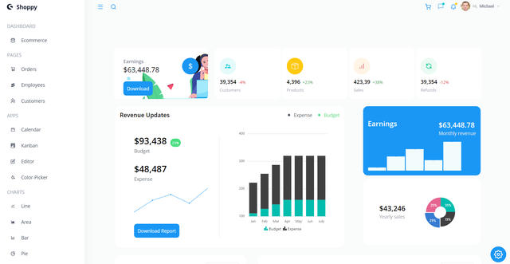

<h1 align="center">Online Journal</h1>
<p>
<h2>Introduction</h2>
Welcome to our online journal project! This web application serves as a comprehensive dashboard site designed to provide a seamless and intuitive experience for managing various aspects of your digital journal. With an array of features and functionalities, it is tailored to meet the needs of both individuals and organizations seeking an efficient way to handle their journal entries, tasks, and data visualization.
</p>
<p>
<h2>Categories</h2>
The dashboard encompasses several categories, each serving a specific purpose: <br /> <br />
I. <b>Ecommerce</b>: Manage and monitor your ecommerce activities, track sales, and analyze performance. <br />
II. <b>Orders</b>: Oversee all your orders with detailed tracking and management capabilities. <br />
III. <b>Employees</b>: Maintain employee information, track performance, and manage HR-related tasks. <br />
IV. <b>Customers</b>: Handle customer data, interactions, and support queries efficiently. <br />
V. <b>Kanban</b>: Implement and manage your tasks using the Kanban methodology for better project management. <br />
VI. <b>Editor</b>: A rich text editor for creating and editing journal entries and other textual content. <br />
VII. <b>Calendar</b>: Schedule and manage your events, deadlines, and appointments with ease. <br />
VIII. <b>Color Picker</b>: A tool for selecting and managing colors for various aspects of your journal. <br />
IX. <b>Charts</b>: Various types of charts (Line, Area, Bar, Pie, Financial, Color Mapping, Pyramid, Stacked) to visualize your data for better insights and analysis. <br />
</p>
<hr />

<hr />
<h2>🍿 Features </h2>
<ul>    
<li>Syncfusion</li> 
<li>React Icons</li> 
<li>React Router DOM</li>
<li>Responsive</li>
</ul>
<hr />
<h2>🍿 Technologies </h2>
<ul>
<li>ReactJs</li>
<li>Tailwind CSS</li>
</ul>
<hr />
<h2>🍿 How to Run the Website on Your System </h2>
<h3> Step 1: Download and Extract the Code </h3>
<p>First, download the entire website code and extract the ZIP file to a folder on your local system.</p>
<h4>Website Code: https://github.com/BilgeGates/Online-Journal.git</h4>
<h3>Step 2: Run the Website
</h3>
<p>Open your code editor (such as VS Code) and navigate to the project directory. Then, open a terminal and run the following command:
npm start</p>
<p>This will start the application. Open a web browser and navigate to <a href="http://localhost:3000">http://localhost:3000</a> to access the website.</p>  
  
```bash
    npm start
 ```
<hr />
<h2>🍿 Demo </h2>
<p> - Check out our live demo at https://online-journal.netlify.app/ </p>
